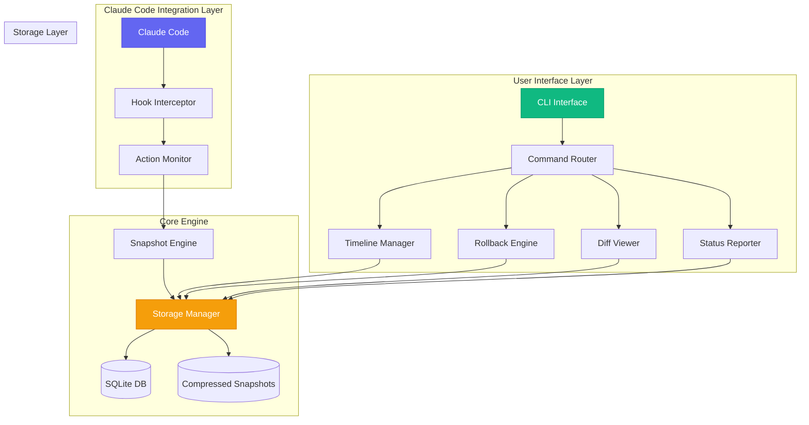

# Design Document

## Overview

The Claude Rewind Tool is architected as a lightweight, high-performance terminal-based system that provides comprehensive time-travel debugging capabilities for Claude Code sessions. The system follows a modular architecture with clear separation of concerns, enabling automatic state capture, granular rollback functionality, and rich visual diff capabilities.

The core design philosophy emphasizes:
- **Non-intrusive operation**: Minimal impact on Claude Code performance
- **Data integrity**: Reliable snapshot capture and storage with corruption detection
- **User experience**: Intuitive terminal interface with rich visual feedback
- **Scalability**: Efficient storage and retrieval for large projects and long sessions

## Architecture

### High-Level System Architecture



### Technology Stack

**Core Language**: Python 3.11+
- **Rationale**: Excellent ecosystem for CLI tools, file operations, and cross-platform compatibility
- **Alternative considered**: Node.js (rejected due to performance concerns with large file operations)

**Key Dependencies**:
- **Click**: CLI framework for command routing and argument parsing
- **Rich**: Terminal UI library for syntax highlighting and interactive elements
- **SQLite3**: Embedded database for metadata storage
- **Watchdog**: File system monitoring for change detection
- **GitPython**: Git integration for repository-aware operations
- **Pygments**: Syntax highlighting for diff viewer
- **Zstandard**: High-performance compression for snapshot storage

## Components and Interfaces

### 1. Hook Interceptor (`hooks/claude_interceptor.py`)

**Purpose**: Seamlessly integrate with Claude Code's execution lifecycle

**Key Interfaces**:
```python
class ClaudeHookManager:
    def register_pre_action_hook(self, callback: Callable) -> None
    def register_post_action_hook(self, callback: Callable) -> None
    def get_current_action_context(self) -> ActionContext
    
class ActionContext:
    action_type: str
    timestamp: datetime
    prompt_context: str
    affected_files: List[Path]
    tool_name: str
```

**Integration Strategy**:
- Monitor Claude Code process through system hooks
- Intercept file system operations before execution
- Capture prompt context and tool metadata
- Fail gracefully if Claude Code API changes

### 2. Snapshot Engine (`core/snapshot_engine.py`)

**Purpose**: Efficiently capture and store project state snapshots

**Key Interfaces**:
```python
class SnapshotEngine:
    def create_snapshot(self, context: ActionContext) -> SnapshotId
    def get_snapshot(self, snapshot_id: SnapshotId) -> Snapshot
    def list_snapshots(self, filters: SnapshotFilters) -> List[SnapshotMetadata]
    
class Snapshot:
    id: SnapshotId
    timestamp: datetime
    metadata: SnapshotMetadata
    file_states: Dict[Path, FileState]
    
class FileState:
    path: Path
    content_hash: str
    size: int
    modified_time: datetime
    permissions: int
```

**Performance Optimizations**:
- **Incremental snapshots**: Only store changed files since last snapshot
- **Content deduplication**: Use SHA-256 hashes to avoid storing duplicate content
- **Compression**: Zstandard compression for 70-80% space savings
- **Lazy loading**: Load file content only when needed for diffs or rollbacks

### 3. Storage Manager (`storage/snapshot_store.py`)

**Purpose**: Manage persistent storage of snapshots and metadata

**Storage Structure**:
```
.claude-rewind/
├── metadata.db          # SQLite database
├── snapshots/
│   ├── cr_001/
│   │   ├── manifest.json
│   │   └── files/
│   │       ├── src_api_py.zst
│   │       └── tests_api_test_py.zst
│   └── cr_002/
└── config.yml
```

**Database Schema**:
```sql
CREATE TABLE snapshots (
    id TEXT PRIMARY KEY,
    timestamp INTEGER NOT NULL,
    action_type TEXT NOT NULL,
    prompt_context TEXT,
    files_affected INTEGER,
    total_size INTEGER,
    compression_ratio REAL
);

CREATE TABLE file_changes (
    snapshot_id TEXT,
    file_path TEXT,
    change_type TEXT, -- 'added', 'modified', 'deleted'
    content_hash TEXT,
    size_bytes INTEGER,
    FOREIGN KEY (snapshot_id) REFERENCES snapshots(id)
);
```

### 4. Rollback Engine (`core/rollback_manager.py`)

**Purpose**: Execute precise rollback operations with conflict resolution

**Key Interfaces**:
```python
class RollbackEngine:
    def preview_rollback(self, target_snapshot: SnapshotId, 
                        options: RollbackOptions) -> RollbackPreview
    def execute_rollback(self, target_snapshot: SnapshotId, 
                        options: RollbackOptions) -> RollbackResult
    def resolve_conflicts(self, conflicts: List[FileConflict]) -> ConflictResolution

class RollbackOptions:
    selective_files: Optional[List[Path]]
    preserve_manual_changes: bool = True
    create_backup: bool = True
    dry_run: bool = False

class RollbackPreview:
    files_to_restore: List[Path]
    files_to_delete: List[Path]
    conflicts: List[FileConflict]
    estimated_changes: int
```

**Smart Rollback Algorithm**:
1. **Conflict Detection**: Compare current state with target snapshot
2. **Manual Change Preservation**: Use three-way merge to preserve user edits
3. **Selective Application**: Allow granular file-level rollback selection
4. **Safety Checks**: Validate rollback won't break project structure

### 5. Diff Viewer (`core/diff_viewer.py`)

**Purpose**: Provide rich visual diff capabilities in terminal

**Key Interfaces**:
```python
class DiffViewer:
    def show_snapshot_diff(self, snapshot_id: SnapshotId) -> None
    def show_file_diff(self, file_path: Path, 
                      before_snapshot: SnapshotId, 
                      after_snapshot: SnapshotId) -> None
    def export_diff(self, snapshot_id: SnapshotId, 
                   format: DiffFormat) -> str

class DiffFormat(Enum):
    UNIFIED = "unified"
    SIDE_BY_SIDE = "side-by-side"
    PATCH = "patch"
    HTML = "html"
```

**Visual Features**:
- **Syntax highlighting**: Language-aware color coding using Pygments
- **Line-by-line annotations**: Show Claude's specific modifications
- **Context lines**: Configurable context around changes
- **Interactive navigation**: Keyboard shortcuts for large diffs

### 6. Timeline Manager (`core/timeline.py`)

**Purpose**: Provide interactive timeline navigation and filtering

**Key Interfaces**:
```python
class TimelineManager:
    def show_interactive_timeline(self) -> None
    def filter_snapshots(self, filters: TimelineFilters) -> List[SnapshotMetadata]
    def bookmark_snapshot(self, snapshot_id: SnapshotId, name: str) -> None
    def search_snapshots(self, query: str) -> List[SnapshotMetadata]

class TimelineFilters:
    date_range: Optional[Tuple[datetime, datetime]]
    action_types: Optional[List[str]]
    file_patterns: Optional[List[str]]
    bookmarked_only: bool = False
```

## Data Models

### Core Data Structures

```python
@dataclass
class SnapshotMetadata:
    id: SnapshotId
    timestamp: datetime
    action_type: str
    prompt_context: str
    files_affected: List[Path]
    total_size: int
    compression_ratio: float
    parent_snapshot: Optional[SnapshotId]

@dataclass
class FileChange:
    path: Path
    change_type: ChangeType  # ADDED, MODIFIED, DELETED
    before_hash: Optional[str]
    after_hash: Optional[str]
    line_changes: List[LineChange]

@dataclass
class LineChange:
    line_number: int
    change_type: ChangeType
    content: str
    context: str

@dataclass
class ProjectState:
    root_path: Path
    git_commit: Optional[str]
    file_tree: Dict[Path, FileMetadata]
    total_files: int
    total_size: int
```

### Configuration Model

```python
@dataclass
class RewindConfig:
    storage:
        max_snapshots: int = 100
        compression_enabled: bool = True
        cleanup_after_days: int = 30
        max_disk_usage_mb: int = 1000
    
    display:
        theme: str = "dark"
        diff_algorithm: str = "unified"
        show_line_numbers: bool = True
        context_lines: int = 3
    
    hooks:
        pre_snapshot_script: Optional[Path] = None
        post_rollback_script: Optional[Path] = None
    
    git_integration:
        respect_gitignore: bool = True
        auto_commit_rollbacks: bool = False
```

## Error Handling

### Error Categories and Strategies

**1. Snapshot Capture Errors**
- **File Permission Issues**: Graceful degradation, log warning, continue
- **Disk Space Exhaustion**: Automatic cleanup of old snapshots, user notification
- **File Lock Conflicts**: Retry mechanism with exponential backoff

**2. Storage Corruption**
- **Database Corruption**: Automatic repair attempt, fallback to file-based metadata
- **Snapshot File Corruption**: Checksum validation, recovery from previous snapshots
- **Partial Snapshot Loss**: Mark as corrupted, prevent rollback to invalid state

**3. Rollback Failures**
- **File Conflicts**: Interactive conflict resolution with merge options
- **Permission Denied**: Clear error message with suggested solutions
- **Partial Rollback**: Atomic operations with full rollback on failure

**Error Recovery Framework**:
```python
class ErrorRecovery:
    def handle_snapshot_error(self, error: SnapshotError) -> RecoveryAction
    def repair_corrupted_storage(self) -> RepairResult
    def validate_system_integrity(self) -> ValidationReport
    
class RecoveryAction(Enum):
    RETRY = "retry"
    SKIP = "skip"
    ABORT = "abort"
    REPAIR = "repair"
```

## Testing Strategy

### Test Categories

**1. Unit Tests**
- **Snapshot Engine**: Test incremental capture, deduplication, compression
- **Rollback Engine**: Test conflict resolution, selective rollback, safety checks
- **Storage Manager**: Test database operations, file I/O, corruption handling
- **Diff Viewer**: Test diff algorithms, syntax highlighting, formatting

**2. Integration Tests**
- **Claude Code Integration**: Mock Claude Code actions, test hook registration
- **End-to-End Workflows**: Complete snapshot → rollback → verification cycles
- **Cross-Platform Compatibility**: Test on Windows, macOS, Linux
- **Performance Tests**: Large project handling, memory usage, speed benchmarks

**3. System Tests**
- **Real Project Testing**: Test with actual codebases of varying sizes
- **Stress Testing**: High-frequency snapshot creation, large file handling
- **Recovery Testing**: Simulate corruption, test repair mechanisms
- **User Acceptance Testing**: CLI usability, error message clarity

### Test Infrastructure

```python
# Test fixtures for consistent testing
@pytest.fixture
def mock_claude_session():
    return MockClaudeSession(
        actions=[
            MockAction("edit_file", "src/api.py", "Add type hints"),
            MockAction("create_file", "tests/test_api.py", "Add tests"),
            MockAction("refactor", "src/", "Extract utilities")
        ]
    )

@pytest.fixture
def sample_project():
    return ProjectBuilder() \
        .with_files(["src/api.py", "src/utils.py", "README.md"]) \
        .with_git_repo() \
        .build()
```

### Performance Benchmarks

**Target Performance Metrics**:
- Snapshot creation: < 500ms for projects under 1GB
- Rollback execution: < 2 seconds for typical changes
- Timeline loading: < 100ms for 1000 snapshots
- Memory usage: < 100MB during normal operation
- Disk overhead: < 10% of project size with compression

### Continuous Integration

```yaml
# .github/workflows/ci.yml
name: CI/CD Pipeline
on: [push, pull_request]

jobs:
  test:
    strategy:
      matrix:
        os: [ubuntu-latest, windows-latest, macos-latest]
        python-version: [3.11, 3.12]
    
    steps:
      - uses: actions/checkout@v3
      - name: Set up Python
        uses: actions/setup-python@v4
        with:
          python-version: ${{ matrix.python-version }}
      
      - name: Install dependencies
        run: pip install -e ".[dev]"
      
      - name: Run tests
        run: pytest --cov=claude_rewind --cov-report=xml
      
      - name: Performance benchmarks
        run: python scripts/benchmark.py
      
      - name: Upload coverage
        uses: codecov/codecov-action@v3
```

This design provides a robust, scalable foundation for the Claude Rewind Tool that addresses all requirements while maintaining high performance and reliability standards.