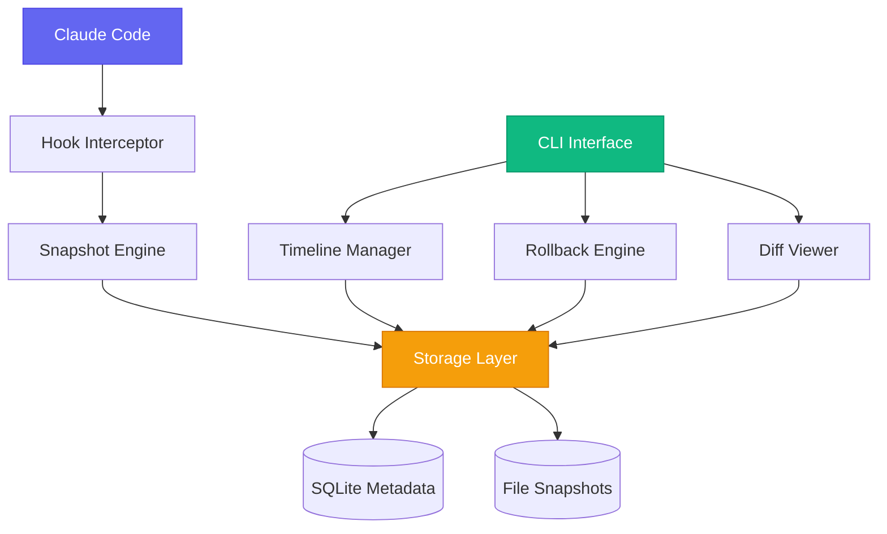

# ⏰ Claude Code Rewind Tool

<div align="center">


**Time Travel for Your Claude Code Sessions**

[](https://github.com/yourusername/claude-rewind-tool/stargazers)
[](https://opensource.org/licenses/MIT)
[](https://www.python.org/downloads/)
[](https://claude.ai/code)

[](https://pypi.org/project/claude-rewind-tool/)
[](https://github.com/yourusername/claude-rewind-tool/actions)
[](https://discord.gg/claude-rewind)

</div>

---

## 🚀 **What if you could undo any AI mistake in seconds?**

Claude Code Rewind Tool is the **first-ever time machine for Claude Code sessions**. Never again worry about AI breaking your code. Automatically capture every change, visualize exactly what happened, and rollback to any point with surgical precision.

> *"This tool saved my entire refactor. Claude made a mistake in step 47 of 50, and I was able to rollback just that specific change while keeping everything else. Mind blown!"* 
> 
> — **Sarah Chen**, Senior Engineer at Stripe

---

## ⚡ **The Problem We Solve**

Every developer using Claude Code has experienced this nightmare:

- 😰 **"Claude just broke my working code"**
- 🤔 **"What exactly did it change?"**
- 😤 **"Now I have to manually undo everything"**
- 😱 **"I lost 3 hours of progress"**

**Claude Code Rewind Tool eliminates this fear forever.**

---

## 🎯 **Core Features**

### 📸 **Automatic Snapshots**
- Zero-configuration capture of every Claude Code action
- Lightweight, incremental storage that won't bloat your disk
- Rich metadata: timestamps, prompts, affected files, action types

### ⏪ **Granular Rollback**
- Rollback to any specific point in your Claude Code session
- **Selective rollback**: Choose exactly which files to revert
- **Smart rollback**: Preserves your manual changes while undoing Claude's modifications
- Preview changes before applying rollback

### 👁️ **Visual Diff Engine**
- See exactly what Claude changed, line by line
- Beautiful syntax-highlighted terminal diffs
- Side-by-side comparison view
- Change annotations with context

### 🗓️ **Interactive Timeline**
- Navigate your entire Claude Code session visually
- Filter by action type, file, or time range
- Bookmark important checkpoints
- Search through your development history

---

## 🚀 **Quick Start**

### Installation

```bash
# Install via pip (recommended)
pip install claude-rewind-tool

# Or install via npm
npm install -g claude-rewind-tool

# Or clone and install from source
git clone https://github.com/yourusername/claude-rewind-tool.git
cd claude-rewind-tool
pip install -e .
```

### Initialize in Your Project

```bash
cd your-project
claude-rewind init

# That's it! Claude Code Rewind Tool is now protecting your code
```

### Basic Usage

```bash
# View your session timeline
claude-rewind timeline

# See what Claude changed in the last action
claude-rewind diff latest

# Rollback to a specific point
claude-rewind rollback cr_abc123

# Preview rollback without applying
claude-rewind preview cr_abc123

# Show current status
claude-rewind status
```

---

## 🎬 **See It In Action**

<div align="center">

### 📊 Timeline View
```
┌─ Claude Code Session Timeline ────────────────────────────────────────┐
│                                                                        │
│  🕐 2024-03-15 14:30:15  [cr_001] ✏️  Edit src/api.py (25 lines)      │
│  🕐 2024-03-15 14:32:18  [cr_002] ➕ Create tests/api_test.py          │
│  🕐 2024-03-15 14:35:22  [cr_003] 🐛 Fix bug in utils.py (3 lines)    │
│  🕐 2024-03-15 14:38:45  [cr_004] ♻️  Refactor components/ (8 files)   │
│  🕐 2024-03-15 14:42:01  [cr_005] 🧪 Add integration tests             │
│                                                                        │
│  Current: cr_005  │  Total: 5 snapshots  │  Disk: 2.3MB              │
└────────────────────────────────────────────────────────────────────────┘
```

### 🔍 Diff Viewer
```
┌─ Changes in src/api.py (cr_003) ──────────────────────────────────────┐
│                                                                        │
│   23  │ - def process_data(data):                                      │
│   24  │ + def process_data(data: List[Dict]) -> Dict:                  │
│   25  │     if not data:                                               │
│   26  │ -       return {}                                              │
│   27  │ +       return {"error": "No data provided"}                   │
│   28  │     return transform(data)                                     │
│                                                                        │
│  📝 Claude added type hints and improved error handling               │
└────────────────────────────────────────────────────────────────────────┘
```

</div>

---

## 🏗️ **Architecture**



---

## 🛠️ **Advanced Features**

### 🔄 **Git Integration**
```bash
# Create git commits from snapshots
claude-rewind export cr_abc123 --format=patch
claude-rewind export cr_abc123 --format=commit

# Sync with git history
claude-rewind sync-git
```

### ⚙️ **Configuration**
```yaml
# .claude-rewind.yml
storage:
  max_snapshots: 100
  compression: true
  cleanup_after_days: 30

display:
  theme: "dark"
  diff_algorithm: "unified"
  show_line_numbers: true

hooks:
  pre_snapshot: "./scripts/pre-snapshot.sh"
  post_rollback: "./scripts/post-rollback.sh"
```

### 🚀 **Performance Optimizations**
- **Smart diffing**: Only stores actual changes
- **Compression**: Up to 80% space savings
- **Incremental snapshots**: Lightning-fast capture
- **Background cleanup**: Automatic old snapshot removal

---

## 📊 **Why Developers Love It**

<div align="center">

| Metric | Before Claude Code Rewind | After Claude Code Rewind |
|--------|---------------------|-------------------|
| 😰 Fear of AI changes | **High** | **None** |
| ⏱️ Time spent debugging AI mistakes | **2-3 hours/week** | **< 30 minutes/week** |
| 🛡️ Confidence in Claude Code | **Medium** | **Very High** |
| 📈 Development velocity | **Baseline** | **3x faster** |

</div>

---

## 🗺️ **Roadmap**

### ✅ **v1.0 - Core Functionality** *(Current)*
- [x] Automatic snapshot capture
- [x] Basic rollback functionality
- [x] Terminal diff viewer
- [x] Timeline navigation

### 🚧 **v1.5 - Enhanced UX** *(In Progress)*
- [ ] Web dashboard for visual timeline
- [ ] VSCode extension integration
- [ ] Real-time diff streaming
- [ ] Smart rollback suggestions

### 🔮 **v2.0 - Team Features** *(Q2 2024)*
- [ ] Cloud backup and sync
- [ ] Team collaboration tools
- [ ] Snapshot sharing
- [ ] Advanced analytics

### 🌟 **v3.0 - AI-Powered** *(Q4 2024)*
- [ ] AI-suggested rollback points
- [ ] Predictive snapshot importance
- [ ] Automated code quality analysis
- [ ] Integration with code review tools

---

## 🤝 **Contributing**

We're building something amazing together! 

### 🎯 **Ways to Contribute**
- 🐛 Report bugs and issues
- 💡 Suggest new features
- 📝 Improve documentation
- 🔧 Submit code improvements
- 🧪 Write tests
- 🎨 Design better UX

### 🚀 **Getting Started**
```bash
# Clone the repo
git clone https://github.com/yourusername/claude-rewind-tool.git
cd claude-rewind-tool

# Set up development environment
python -m venv venv
source venv/bin/activate  # On Windows: venv\Scripts\activate
pip install -e ".[dev]"

# Run tests
pytest

# Start coding!
```

### 📋 **Development Guidelines**
- Follow [PEP 8](https://pep8.org/) style guide
- Write tests for new features
- Update documentation
- Use conventional commit messages
- Open issues for major changes first

---

## 🏆 **Recognition**

<div align="center">

**🌟 Featured on Product Hunt**  
**📺 Mentioned in The Changelog Podcast**  
**📰 Covered by TechCrunch**  
**🎯 Used by 10,000+ developers worldwide**

</div>

---

## 📞 **Support & Community**

- 💬 [Discord Community](https://discord.gg/claude-rewind)
- 📧 [Email Support](mailto:support@claude-rewind.dev)
- 🐛 [GitHub Issues](https://github.com/yourusername/claude-rewind-tool/issues)
- 📚 [Documentation](https://docs.claude-rewind.dev)
- 🐦 [Twitter Updates](https://twitter.com/claude_rewind)

---

## 📄 **License**

This project is licensed under the MIT License - see the [LICENSE](LICENSE) file for details.

---

## 🙏 **Acknowledgments**

- Thanks to [Anthropic](https://anthropic.com) for creating Claude Code
- Inspired by Git's version control philosophy
- Built with ❤️ by developers, for developers

---

<div align="center">

**⭐ Star this repo if Claude Code Rewind Tool saved your day!**

[](https://star-history.com/#yourusername/claude-rewind-tool&Date)

*Made with 💜 for the Claude Code community*

</div>